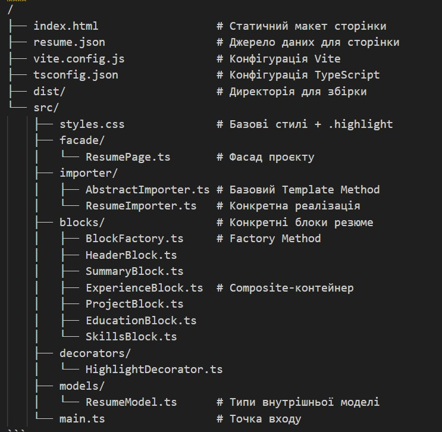
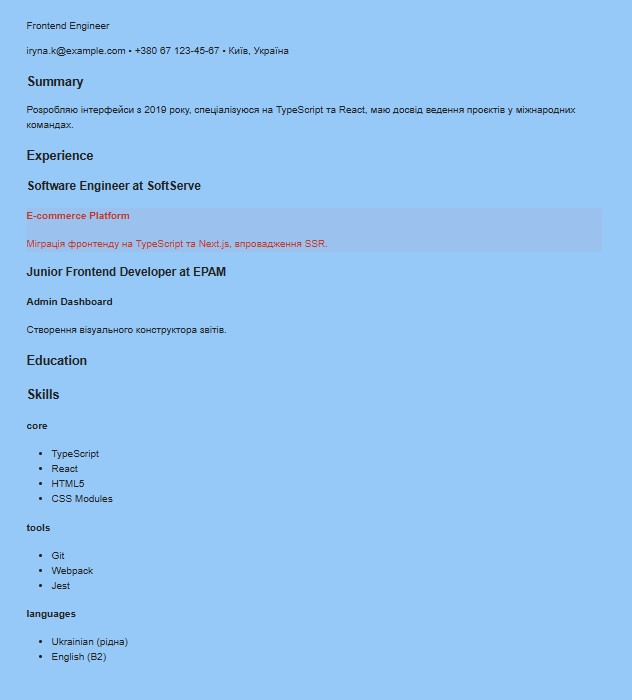

# Домашка - Фінальний проєкт

# «Генератор резюме з JSON‑опису»

## Опис завдання

У цьому фінальному домашньому завданні необхідно реалізувати генератор резюме, який демонструє застосування п'яти патернів проектування: Facade, Template Method, Factory Method, Composite, Decorator.

Завдання має на меті навчити вас:

- Правильно застосовувати патерни проектування в практичних сценаріях
- Створювати модульну, розширювану архітектуру
- Структурувати код з використанням патернів

Необхідно сформувати самодостатню HTML‑сторінку‑резюме, яка будується з єдиного джерела даних — файл `resume.json`. Усі стилі фіксовані у `styles.css`, сторонніх бібліотек або фреймворків не використовуємо. Після компіляції `main.ts` і відкриття `index.html` сторінка повинна безпомилково відобразити повне резюме, а проєкти з прапорцем `"isRecent": true` — підсвітити червоним.

## Структура проекту

## Запуск проекту

1. Встановлення залежностей:

   npm install

2. Режим розробки:

   npm run dev

3. Збірка для продакшену:

   npm run build

4. Попередній перегляд збірки:

   npm run preview

## Технології

- TypeScript
- Vite (збірка та розробка)
- Патерни проектування
- JSON для зберігання даних
- CSS для стилізації

## Проект

